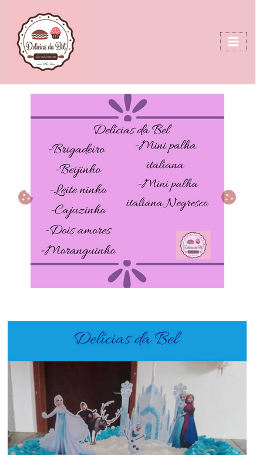

&emsp;&emsp;&emsp;&emsp;&emsp;&emsp;&emsp;&emsp;&emsp;&emsp;&emsp;&emsp;&emsp;&emsp;&emsp;&emsp;&emsp;&emsp;&emsp;&emsp;&emsp;&emsp;&emsp;&emsp;&emsp;

## Link do site: https://deliciasdabel.000webhostapp.com

 
 
## Delícias da Bel foi criado sem fins lucrativos a proposto de pratica e também para divulgar o trabalho de uma amiga.

## Tecnologias utilizadas para a criação do site:

- HTML5
- CSS3
- BOOTSTRAP 4

## Site responsivo de acordo com a resolução

## icones utilizados: https://fontawesome.com/
